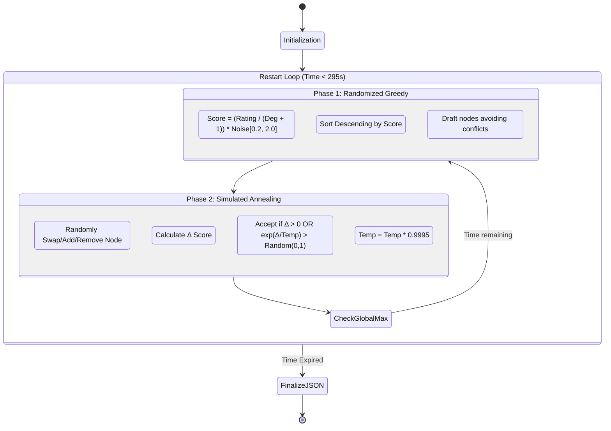
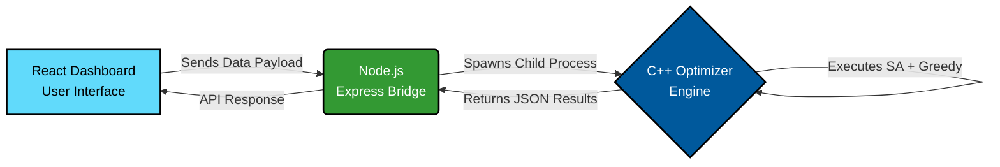

# 🧠 The Algorithm

Solving the **Maximum Weight Independent Set** problem on general graphs is mathematically NP-Hard. To achieve near-optimal results within the strict 5-minute execution window without triggering a Time Limit Exceeded (TLE) error, this engine utilizes a **Multi-Start Randomized Greedy** approach combined with **Simulated Annealing (SA)**.

### 🔄 Algorithmic Flow



#### Phase 1: Multi-Start Randomized Greedy *(Escaping the Black Hole)*
A standard greedy algorithm is easily trapped by "Hub" nodes (single individuals with massive ratings but maximum conflicts). To break this symmetry, the algorithm recalculates a dynamic heuristic every iteration:

$$
\text{Heuristic Score} = \left( \frac{\text{Rating}}{\text{Degree} + 1.0} \right) \times \text{Random\_Noise}(0.2, 2.0)
$$

This injects controlled chaos, allowing the algorithm to occasionally ignore massive trap nodes and explore vastly different team topologies.

#### Phase 2: Simulated Annealing *(Fine-Tuning)*
After generating a solid baseline team, Simulated Annealing steps in to make micro-adjustments. Using the **Metropolis-Hastings criterion** ($e^{\Delta/T}$), the engine occasionally accepts a negative move (firing a good coder) to make room for multiple smaller additions, escaping local maxima. As the "temperature" cools, it locks into the strict global maximum for that iteration.

---

### ⏱️ Time & Space Complexity

Given $N$ (Coders) and $M$ (Conflicts), and an execution window of $T$ seconds:

| Phase | Time Complexity | Space Complexity |
| :--- | :--- | :--- |
| **Graph Construction** | $\mathcal{O}(N + M)$ | $\mathcal{O}(N + M)$ |
| **Randomized Greedy Draft** | $\mathcal{O}(N \log N + M)$ | $\mathcal{O}(N)$ |
| **Simulated Annealing Step** | $\mathcal{O}(\text{deg of swapped node})$ | $\mathcal{O}(1)$ |
| **Total Pipeline** | $\mathcal{O}(K \times (N \log N + S \times D_{avg}))$ | $\mathcal{O}(N + M)$ |

> **Where:** > * $K$ = Number of random restarts fitting within the limit.
> * $S$ = Number of SA steps per restart (approx. 20,000).
> * $D_{avg}$ = Average degree of a node.

> ⚠️ **Why 295 Seconds?** > The engine intentionally halts 5 seconds before the hard 300-second tournament limit. This buffer guarantees enough time to safely format the final array into a massive JSON string and pipe it back to the Node.js bridge without triggering a Time Limit Exceeded execution penalty.

---

## 🏗️ System Workflow

The project is split into three distinct layers to handle the intensive computation without blocking the UI.



---

## 💻 How to Run Locally

### Prerequisites
* **Node.js** (v18+ recommended)
* **C++ Compiler** (g++ via MinGW/MSYS2 for Windows, or Clang for Mac)

### Step 1: Compile the C++ Engine
Open a terminal and navigate to the engine directory. Compile the optimizer with standard optimization flags:

```bash
cd engine
g++ optimizer.cpp -O3 -o optimizer.exe
```

### Step 2: Start the Middleware Bridge
Open a new terminal instance and navigate to the backend directory. Install dependencies and start the Express server:

```bash
cd backend
npm install
node server.js
```

### Step 3: Launch the React Dashboard
Open a third terminal instance and navigate to the UI directory. Install dependencies and start the Vite development server:

```bash
cd hackathon-squad-ui
npm install
npm run dev
```
